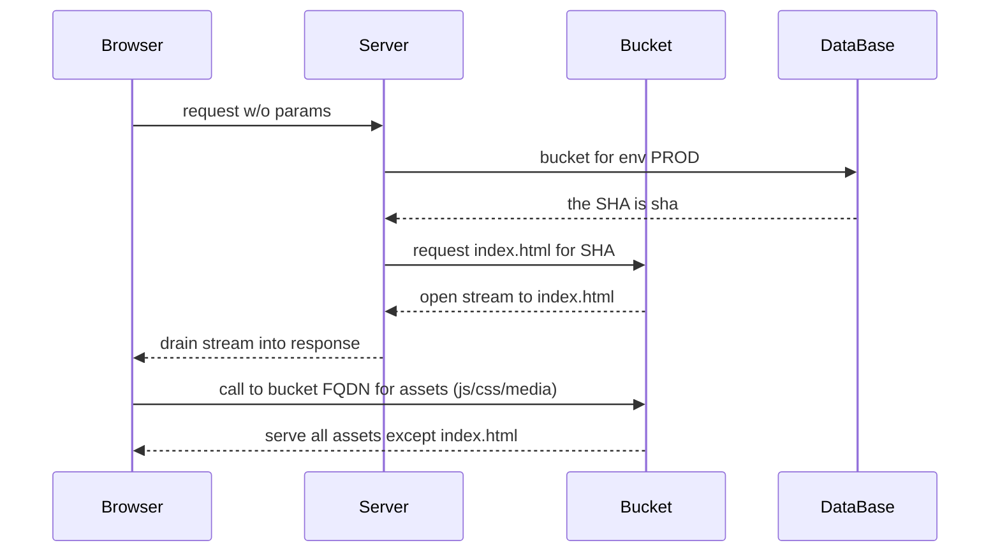
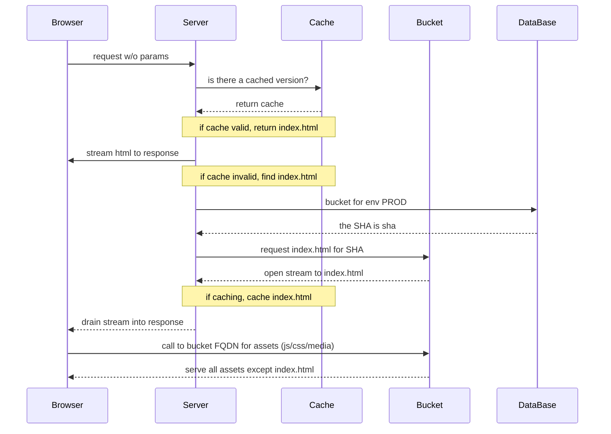
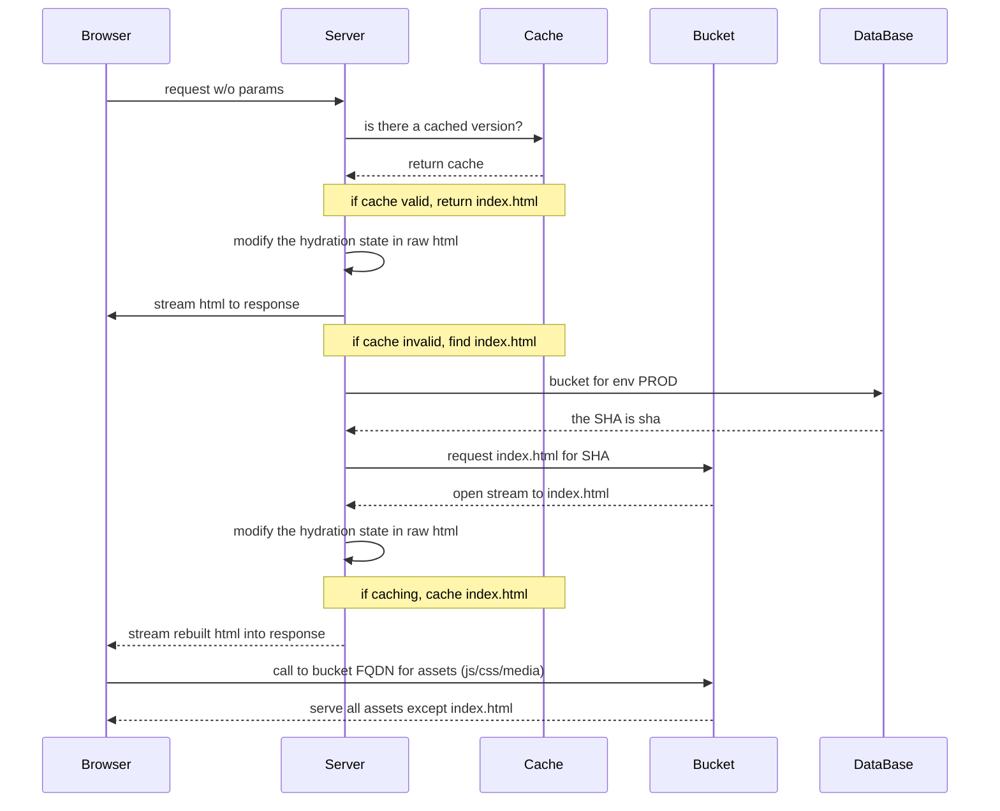

# artifact-switcher

## what does this do?

this is an application designed to allow serving any built assets from a bucket or bucket adjacent storage mechanism.

## layouts

### basic example

ths serves to illustrate the default working of this application:

fundamentally, we store a reference to where the JS bundle we built is deployed, use an express server to stream that index.html from a bucket via a vanity URL, and then the resolved index.html will reference the public path to the bucket. this allows us to:

1. build a webpack bundle using [PUBLIC_URL](https://webpack.js.org/guides/public-path/) or any equivalent for your bundler
1. upload the content to the bucket via `SHA/*.js`. this means each commit of your app will result in a unique bucket with easy tracing to where it came from
1. update the `artifact-switcher` to point to the new bundle

> this is important as we are just updating a DB row to perform a release, though your build may take forever, the release time is instant as well as the rollback time

### caching example

with caching we can return the base html only if we get an update. this make us able to eliminate the DB call roundtrip, for when fast is the only thing that matters.

### hydration example

this is the same as caching, except that you can inject values into the HTML. this concept is called 'hydration' and will allow you to add both HTML and JS to the html to prerender certain states for your app.

